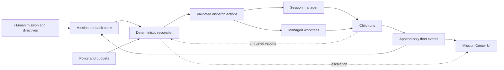

# Argus-Inspired Mission Orchestration Plan

**Status:** Proposed  
**Created:** 2026-08-30  
**Implementation:** Not started  
**Suggested effort split:** Claude 70–75%; Codex 25–30%

## Goal

Evolve Claudia from a strong manual multi-session console into a durable, supervised fleet
manager inspired by [Argus](https://www.scape.work/argus), without copying Scape-specific
features or weakening Claudia's approval, diff, plan-review, and repository controls.

The product should let a person define a mission, break it into explicit tasks, dispatch bounded
child runs into managed worktrees, watch progress as a hierarchy, intervene when needed, and
accept completed work through a test/PR contract. It must recover correctly after Claudia or the
browser restarts.

## Product position

Claudia already has the difficult session-level pieces: structured Claude Agent SDK state,
Claude and Codex drivers, approvals, diffs, plans, worktrees, resume/fork/checkpoints,
transcripts, todos, subagents, templates, notifications, and finish chains. The missing layer is
not another terminal grid. It is a persistent manager above those sessions.

Argus's useful ideas are:

- A persistent mission with an explicit Watching, Paused, or No mission state.
- A periodic pulse that reconciles desired work with actual child state.
- Bounded child concurrency and shallow, visible hierarchy.
- Structured fleet events instead of relying on terminal prose.
- Capability-scoped manager directives and untrusted child reports.
- Managed worktree setup, ownership, recovery, and cleanup.
- A clear choice to stop or detach children when deleting a mission.

Claudia should retain its own identity: local-first, repository-aware, human-supervised, and able
to operate both Claude and Codex rather than becoming a clone of Scape's wider workspace.

## Current gaps and risks

The audit found these product and implementation gaps:

- The protocol launches, resumes, and forks individual sessions, but has no durable mission,
  task, child-run, or reconciliation commands (`shared/src/protocol.ts`).
- Session and feed state are memory-resident, while transcript history is intentionally not
  persisted (`server/src/session-manager.ts`, `server/src/settings-store.ts`).
- Stopped sessions remain full board tiles and count toward the 12-session ceiling until manually
  removed. This makes historical clutter an operational limit.
- The board is flat: it cannot show mission → task → attempt relationships, dependencies,
  acceptance state, or fleet-level decisions.
- Browser-close behavior can stop sessions shortly afterward, which conflicts with a durable
  autonomous manager.
- Worktrees have no ownership ledger or safe managed-cleanup path; an existing directory may be
  reused without proving it belongs to the intended run (`server/src/worktree.ts`).
- Incoming WebSocket JSON is cast to a command without runtime schema validation, and direct
  socket fanout has no explicit backpressure/resync policy (`server/src/gateway.ts`).
- Any loopback origin is accepted rather than an exact UI-origin allowlist
  (`server/src/origin-guard.ts`).
- There is no watchdog, stuck-run detection, retry/escalation policy, per-mission budget, trusted
  manager/child messaging boundary, or durable completion contract.
- A finish-chain idle state means the process settled; it does not establish that a task met its
  acceptance criteria.

## Proposed architecture

Use SQLite for durable operational state. Keep the existing settings JSON for preferences. The
model may recommend actions, but a deterministic server-side reconciler must validate and execute
them within concurrency, budget, capability, repository, and lifecycle policies.



### Durable entities

| Entity | Minimum data |
| --- | --- |
| `Mission` | name, body, status, watch state, pulse interval, max children, risk policy, timestamps |
| `Task` | mission, title, description, repository, status, priority, dependencies, acceptance criteria |
| `ChildRun` | task, session, worktree, harness, attempt, state, timestamps, terminal reason |
| `WorktreeRecord` | repository, path, branch, base SHA, owner mission/task, state, dirty flag, last seen |
| `FleetEvent` | monotonic sequence, mission, actor, event kind, typed payload, timestamp |
| `Escalation` | source, requested capability/decision, reason, severity, resolution, timestamps |

Events should be append-only and reducers idempotent. Current state may be materialized for fast
reads, but restart recovery must be derivable and testable. Every dispatch and destructive action
needs an idempotency key.

### Trust and capability boundary

- Human directives are trusted within Claudia's existing repository allow rules.
- Manager actions are capability-scoped and checked by the server.
- Child reports and peer messages are untrusted input, rate-limited, size-bounded, and unable to
  grant capabilities.
- Default child capabilities are repository-scoped read/write/test. Browser access, remote hosts,
  destructive operations, push, merge, and permission expansion require explicit policy or human
  approval.
- No task can delete a dirty or unmerged worktree automatically.

## User experience

Add a Mission Center above the current session board rather than replacing useful session detail.

```text
Mission: Ship durable orchestration                    [Watching] [Pause]
├─ Task A  Define persistence contract                 complete
│  └─ Claude run #1                                    tests passed
├─ Task B  Build Mission Center                        working
│  └─ Codex run #1                                     editing UI
├─ Task C  Add reconciler                              blocked by A
└─ Escalations (1)  Child requests permission to push  review
```

Required interaction design:

- A mission header with Watching/Paused/No mission, pulse timing, concurrency, budget, and a
  plain-language next-action explanation.
- Nested mission → task → attempt hierarchy. Completed attempts collapse into compact history;
  they do not remain equally prominent stopped tiles.
- A structured, filterable event timeline showing dispatch, state change, decision, test, retry,
  escalation, and cleanup events.
- A dependency/status view that remains legible with 0, 1, 4, 12, and 16 children.
- An escalation inbox with requested action, risk, source, affected repository, and approve/deny
  consequences.
- Explicit empty, loading, reconnecting, recovering, paused, blocked, degraded, and failed states.
- Deleting a mission must offer **stop children** or **detach children**. Managed cleanup must
  preview branches/worktrees and refuse unsafe deletion.
- Task completion must show acceptance criteria, tests, branch, diff summary, PR URL/status,
  unresolved risks, and produced artifacts.

## Ownership strategy

Use Claude for most implementation because the work is backend-heavy and more Claude tokens are
available. Use Codex where visual hierarchy, interaction modeling, dense operational UI, and
cross-cutting UX review have the highest leverage.

| Area | Primary | Supporting role |
| --- | --- | --- |
| SQLite schema, migrations, repositories, recovery | Claude | Codex reviews user-visible failure/recovery states |
| Runtime protocol schemas and gateway validation | Claude | Codex reviews UI contract ergonomics |
| Reconciler, scheduler, budgets, retries, watchdog | Claude | Codex designs explainability and intervention surfaces |
| Session/worktree lifecycle and Git/process APIs | Claude | Codex designs safe cleanup and conflict UX |
| Capability lineage, trust boundaries, security | Claude | Codex reviews approval comprehension and error prevention |
| Mission Center information architecture | Codex | Claude exposes stable query/command APIs |
| Hierarchy, timeline, DAG/status, fleet visualization | Codex | Claude provides typed events and fixtures |
| Loading, empty, failure, recovery, accessibility | Codex | Claude supplies deterministic states and test hooks |
| Completion/PR/test integrations | Claude | Codex builds acceptance and review UI |
| Load, crash, recovery, platform hardening | Claude | Codex runs visual-density and usability QA |

Claude should write roughly three backend PRs for every Codex UI/integration PR. Codex should not
duplicate Claude's backend implementation. Instead, Codex should supply interaction specifications,
state diagrams, story fixtures, UI code, accessibility checks, and adversarial integration review.
Claude should review any Codex change that affects persistence, process control, Git, or protocol
semantics; Codex should review every Claude change that exposes a new user-visible state.

## Progressive stacked PRs

Each PR must have one owner, an explicit base, independently passing tests, and no hidden reliance
on a later PR. Rebase each open stack after its base merges. Avoid concurrent edits to
`shared/src/protocol.ts`, `server/src/gateway.ts`, and `web/src/store.ts`; hand those files off at
documented stack boundaries.

### Stack 0 — Contracts and foundations

#### PR 0: ADRs, domain model, and UI state specification — Codex primary, Claude review

- Record proposed defaults and non-goals.
- Define mission/task/run/event state machines and legal transitions.
- Define command/query/event contracts without implementing dispatch.
- Add Mission Center wireframes for small and dense fleets.
- Document recovery, escalation, deletion, and completion user journeys.

**Gate:** Both implementers can build against the same states without inventing new semantics.

#### PR 1: Runtime schemas and SQLite persistence — Claude

- Add runtime validation for every inbound command and persisted event payload.
- Add SQLite migrations and repositories for all durable entities.
- Add transactions, monotonic event sequencing, idempotency keys, and repository tests.
- Preserve settings JSON only for preferences.

**Gate:** Invalid commands fail safely; state survives restart; migrations work from empty and
previous schemas.

#### PR 2: Durable mission APIs and restart reconciliation — Claude

- Implement mission/task CRUD, watch state, explicit task dependencies, and event queries.
- Reconcile persisted runs with live processes/worktrees on startup.
- Separate active concurrency from stopped/history records.
- Make manager lifetime independent of a browser connection when Watching.

**Gate:** A manually defined mission and its task history recover after a forced server restart.

### Stack 1 — Managed execution

#### PR 3: Worktree ownership and safe lifecycle — Claude

- Record ownership, base SHA, branch, dirty state, and last-seen state.
- Reject ambiguous existing directories and repository/path mismatches.
- Add previewable archive/cleanup operations with dirty/unmerged safeguards.
- Test Windows and macOS path behavior.

**Gate:** No run can claim or delete an unverified worktree.

#### PR 4: Mission Center shell and fleet hierarchy — Codex

- Add mission navigation/header, watch controls, task hierarchy, compact completed history, and
  selected-child detail.
- Add responsive density modes and keyboard navigation.
- Cover 0/1/4/12/16-child fixtures plus loading, reconnecting, and recovering states.

**Gate:** Users can understand mission health, active work, blockers, and next action without
opening terminal output.

#### PR 5: Explicit-task dispatcher and deterministic reconciler — Claude

- Dispatch only human-authored tasks whose dependencies are satisfied.
- Enforce max children, per-mission time/token/cost budgets, repository policy, and idempotency.
- Implement pause/resume without losing state.
- Emit typed explanations for every action or refusal.

**Gate:** Repeated pulses never duplicate a run and never exceed configured policy.

#### PR 6: Timeline, pause, and escalation UX — Codex

- Build the structured fleet timeline and plain-language pulse explanation.
- Build pause/resume, blocked-task, degraded-state, and escalation-inbox flows.
- Make approvals show source, capability, scope, consequences, and expiry.

**Gate:** A user can diagnose and resolve a blocked mission without reading raw logs.

### Stack 2 — Guarded autonomy and completion

#### PR 7: Watchdog, retry policy, capability lineage, and trusted messaging — Claude

- Detect stuck, silent, crashed, orphaned, and repeatedly failing runs.
- Add bounded retry/backoff and escalation rules.
- Add signed/session-bound capability lineage for manager-to-child directives.
- Rate-limit and bound untrusted child reports; prohibit capability self-escalation.
- Tighten UI origin/token binding and WebSocket validation.

**Gate:** Fault injection produces bounded retries and a durable escalation, never an unbounded
loop or silent privilege expansion.

#### PR 8: Completion contract and PR/test integration — Claude

- Collect acceptance results, test commands/outcomes, branch, diff summary, PR status, artifacts,
  and unresolved risks.
- Distinguish process idle, task reported complete, and task accepted.
- Prevent cleanup while required evidence is missing or work is dirty/unmerged.

**Gate:** A task cannot become Accepted without machine-readable evidence and an auditable human
or policy decision.

#### PR 9: Acceptance dashboard and fleet visualization — Codex

- Build acceptance review, evidence comparison, PR/test status, retry/reassign, and safe cleanup
  preview.
- Add clear change-over-time and dependency visualization without overwhelming small missions.
- Complete accessibility, focus management, reduced-motion, contrast, and screen-reader review.

**Gate:** The end-to-end path from task creation to acceptance and cleanup is understandable and
fully keyboard operable.

### Stack 3 — Scale and release hardening

#### PR 10: Backpressure, resync, crash recovery, and end-to-end hardening — Claude primary

- Add WebSocket coalescing/backpressure and sequence-based resync.
- Exercise database corruption/backup behavior, process crash recovery, orphan reconciliation,
  and large histories.
- Add end-to-end tests for pause, restart, retry, approval, detach, archive, and cleanup.
- Profile 16 active children and long event timelines.

Codex performs the final visual-density, responsive, accessibility, and failure-state audit and
may follow with a small UI-only polish PR.

**Gate:** The release candidate passes fault, recovery, scale, platform, accessibility, and visual
regression checks.

## Milestones

1. **Durable manual fleets** — PRs 0–4: explicit mission/tasks, persistence, recovery, owned
   worktrees, and hierarchy UI.
2. **Supervised execution** — PRs 5–6: bounded explicit-task dispatch, pause/resume, budgets,
   event explanations, and escalations.
3. **Guarded autonomy** — PR 7 and a later opt-in decomposition PR: watchdog, bounded retry,
   capability lineage, and policy-controlled model recommendations.
4. **Verifiable completion** — PRs 8–10: acceptance evidence, PR/test integration, cleanup,
   backpressure, recovery, scale, and accessibility hardening.

Do not add model-driven task decomposition until Milestone 2 is stable. When added, decomposition
creates proposed tasks for validation; it does not bypass the deterministic dispatcher or policy
gate.

## Proposed defaults

- SQLite is the operational store; JSON remains preference storage.
- Watching missions survive UI disconnects and server restart reconciliation.
- Default max children is 4; available presets are 1, 2, 4, and 8, with a temporary hard ceiling
  of 12 until the 16-child scale gate passes.
- Pulse default is 60 seconds and may be configured from 30 seconds to 4 hours.
- Default child scope is one repository/worktree with read, edit, and test capabilities.
- Push, merge, destructive cleanup, browser use, remote execution, and capability expansion require
  explicit policy or approval.
- No automatic merge. No automatic deletion of dirty or unmerged worktrees.
- Mission deletion always asks whether to stop or detach active children.

## Verification matrix

- Reducer idempotency, event ordering, duplicate command, and transaction rollback tests.
- Migration, forced restart, process crash, orphan session, stale worktree, and missing-path tests.
- Dependency, concurrency, time/token/cost budget, pause, and pulse-repeat tests.
- Stuck/silent child, bounded retry, expired approval, denied capability, and malicious child-report
  tests.
- Dirty/unmerged worktree, completion-evidence, PR failure, detach, archive, and cleanup tests.
- WebSocket reconnect, resync, slow consumer, burst event, and long-history tests.
- Windows/macOS repository and path fixtures.
- Visual fixtures and regression coverage at 0, 1, 4, 12, and 16 children; narrow and wide layouts;
  keyboard-only and screen-reader journeys.

## Non-goals for the first release

- Reproducing Scape notes, tables, backchannels, browser, or general automation features.
- OpenCode support, SSH/remote workers, or multi-host orchestration.
- Arbitrary peer-to-peer agent chat.
- Fully autonomous push, merge, or destructive cleanup.
- Automatic model-driven decomposition in the durable-manual-fleet milestone.
- Replacing Claudia's existing detailed session, approval, diff, or plan-review surfaces.

## Reference material

- [Argus overview](https://www.scape.work/docs/argus)
- [Mission mentions](https://www.scape.work/docs/mission-mentions)
- [Inter-session messaging](https://www.scape.work/docs/inter-session-messaging)
- [Worktree hooks](https://www.scape.work/docs/worktree-hooks)
- [MCP tools](https://www.scape.work/docs/mcp-tools)

